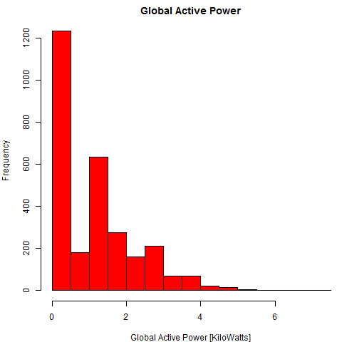

## Introduction

This REPO contains plot png files and R scripts for Exploratory Data Analysis: Assignement 1

Each script takes two arguments:

Argument name | What is it?                                       | Default Value
------------- | ------------------------------------------------- | -------------
Directory     | the directory where the data folder is located    | the current workingdirectory set in R
Start Date    | the analysis start date in the format DD/MM/YYYY  | 01/02/2007

Each script generates plot_X.png with the 2 days data starting from start_date.

Each Script calls another script, getTheDataSet.R which is also included and it is for reading from the big dataset only the 
rows of the 2 days to be analysed.

getTheDataSet.R is to be located in the same directory as the plot scripts, specifically in the R workingdirectory

 
Author: Paolo Raffin, 22.09.2017

The generated four plots are shown below. 

### Plot 1

 

### Plot 2

 

### Plot 3

 

### Plot 4

 

